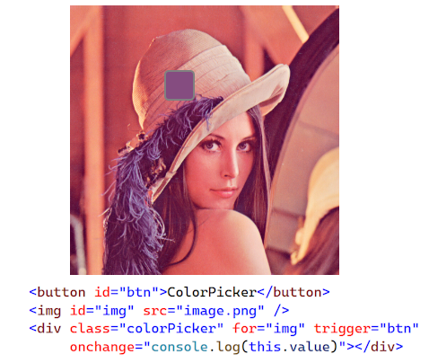

# Silmple ColorPicker in Javascript
This lightweight Color Picker in Javascript will extract the color of an Image based on mouse position on this image.

It can be inserted with almost no knowledge on JS or CSS and has no external dependency (jQuery, ...)

Add the script (colorPicker.js) and CSS (colorPicker.css) in your page and your are good to go.

# Features
- Lightweight
- Allows multiple colorPickers on the same page
- Works on all desktop browsers, mobile and touch devices
- No external dependency
- Easy to integrate (No need for advanced JS or CSS knowledge)
- Customizable
- Works on images

# Samples
Have look at this [samples page](http://vincentguigui.github.io/ColorPickerJS/samples.html) to see how it looks.


# Usage

## 1. Include the script and CSS
Include the script and CSS in your page either in the HEAD tag using defer:
```
	<script src="colorPicker.js" type="text/javascript" defer></script>
```
```
    <link rel="stylesheet" type="text/css" href="colorPicker.css" />
```

## 2. Add a colorPicker element in your page

For example:
```
<div class="colorPicker" [attributes]>content</div>
```
[attributes] are optional and can be used to customize the colorPicker (see below)
	- (mandatory) for="idOfTheImage": id of the image to pick the color from
	- (optional) trigger="idOfClickableElement": id of the element that will trigger the colorPicker"
	- (optional) onchange="functionName": function to call when the color has been picked

## Recommended Integration: Only with HTML attributes
You can integrate the colorPicker in your page with only HTML:
```
	
	<button id="btn">Pick a color</button>
	<div class="colorPicker" for="img" trigger="btn" onchange="console.log(this.value)"></div>
```

## Integration: with HTML attributes and JS handler
You can integrate the colorPicker in your page with only HTML and use a JS event to handle color change:
```
	
	<button id="btn">Pick a color</button>
	<div class="colorPicker" for="img" trigger="btn" onchange="onColorPickerChanged"></div>
	<script>
		function onColorPickerChanged(e) {
			console.log(e.value)
		}
	</script>
```


## Integration: with HTML attributes and multiple JS handlers
You can integrate the colorPicker in your page with only HTML and use a JS event to handle color change:
	- trigger: add a "click listener on an element (button, div, ...) to enable the colorPicker
	- onchange event is fired when the color has been picked (e.detail.value contains the color)
	- onColorPickerEnabled event is fired when the colorPicker has been enabled
	- onColorPickerDisabled event is fired when the colorPicker has been disabled
```
	
	<button id="btn">Pick a color</button>
	<div class="colorPicker" for="img"></div>
	<script>
		btn.addEventListener('click', function () {
			var colorPicker = document.querySelector('.colorPicker');
			colorPicker.addEventListener("onchange", function (e) {
				console.log(e.detail.value);
			});
			colorPicker.addEventListener("onColorPickerEnabled", function (e) {
				console.log("onColorPickerEnabled");
			});
			colorPicker.addEventListener("onColorPickerDisabled", function (e) {
				console.log("onColorPickerDisabled");
			});
			colorPicker.enableColorPicker();
		});
	</script>
```


## Visual customisation
You can customize the colorPicker by adding style to the element (inline or class):
- **border**: initial color of the element
- **border-radius**: radius of the corner
- ...
